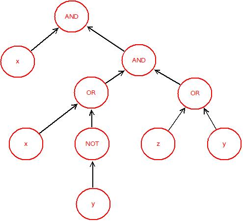
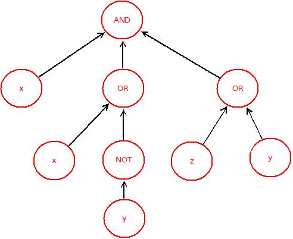

# Obwody współbieżne

Obwody boolowskie reprezentują wyrażenia boolowskie przy pomocy grafów, np. wyrażenie  
`x ∧ (x ∨ ¬y) ∧ (z ∨ y)`  
może być przedstawione za pomocą drzewa



lub, jeśli dopuścimy operatory dużych arności, za pomocą drzewa.



---

Zwyczajowo obliczenia boolowskie są wyliczane od lewej do prawej, zatem w wyrażeniu `x ∧ y`  
najpierw wyliczamy wartość `x`, a następnie wartość `y`.  

Tak zwane **leniwe wyliczanie** (*lazy evaluation*) może pominąć wyliczenie części podwyrażeń, jeśli wartość już obliczonych pozwala ustalić wartość całego wyrażenia.  

Na przykład wyrażenie `true ∨ x` nie musi wyliczać wartości `x`, by poznać wartość całego wyrażenia, które wylicza się do `true`.  

Zwróćmy uwagę, że jeśli wyrażenia nie generują efektów ubocznych, to kolejność wyliczania podwyrażeń nie powinna wpływać na wartość całego wyrażenia, więc wyliczanie wartości podwyrażeń może odbywać się współbieżnie.

---

## Zadanie
Waszym zadaniem jest implementacja programu pozwalającego na współbieżne wyliczanie wartości wyrażeń boolowskich. Program powinien pozwalać na równoczesne wyliczanie wielu wyrażeń i wyliczać wartości pojedynczych wyrażeń współbieżnie.

---

## Wyrażenie boolowskie
Wyrażenie boolowskie jest zdefiniowane indukcyjnie:

- Stałe `true` oraz `false` są wyrażeniami boolowskimi.  
- `NOT a`, negacja wyrażenia boolowskiego `a`, jest wyrażeniem boolowskim.  
- Koniunkcja `AND(a1, a2, …)` oraz alternatywa `OR(a1, a2, …)` pewnej liczby wyrażeń boolowskich (co najmniej dwu) są wyrażeniami boolowskimi.  
- Instrukcja warunkowa `IF(a, b, c)` jest wyrażeniem boolowskim.  
- Wyrażenia progowe `GTx(a1, a2, …, an)` oraz `LTx(a1, a2, …, an)`, gdzie `n ≥ 1` i `x ≥ 0` są liczbami całkowitymi, są wyrażeniami boolowskimi.  

---

## Semantyka
Dla wyrażenia `a`, przez `[a]` oznaczamy wartość wyrażenia `a`.

- `[true] = true`  
- `[false] = false`  

- `[AND(a1, a2, …, an)] = true`, jeśli każde wyrażenie `ai`, `1 ≤ i ≤ n`, spełnia `[ai] = true`,  
  w przeciwnym przypadku `[AND(a1, a2, …, an)] = false`.

- `[OR(a1, a2, …, an)] = true`, jeśli istnieje wyrażenie `ai`, `1 ≤ i ≤ n`, spełniające `[ai] = true`,  
  w przeciwnym przypadku `[OR(a1, a2, …, an)] = false`.

- `[GTx(a1, a2, …, an)] = true`, jeśli co najmniej `x + 1` wyrażeń `ai` spełnia `[ai] = true`,  
  w przeciwnym przypadku `[GTx(a1, a2, …, an)] = false`.

- `[LTx(a1, a2, …, an)] = true`, jeśli co najwyżej `x − 1` wyrażeń `ai` spełnia `[ai] = true`,  
  w przeciwnym przypadku `[LTx(a1, a2, …, an)] = false`.

- `[IF(a, b, c)] = [b]`, jeśli `[a] = true`,  
  w przeciwnym przypadku `[IF(a, b, c)] = [c]`.

---

## Specyfikacja
W rozwiązaniu obwody są reprezentowane poprzez obiekty klasy `Circuit`, a ich wartości wyliczane są poprzez obiekty implementujące interfejs `CircuitSolver`, zwane solverami.

```java
public interface CircuitSolver {
    public CircuitValue solve(Circuit c);
    public void stop();
}
````

gdzie `CircuitValue` ma następujący interfejs:

```java
public interface CircuitValue {
    public boolean getValue() throws InterruptedException;
}
```

* Metoda `solve(Circuit c)` niezwłocznie zwraca specjalny obiekt typu `CircuitValue` reprezentujący wartość obwodu.
* Wartość tę można pobrać wywołując metodę `CircuitValue.getValue()`, która czeka, aż wartość będzie wyliczona.
* Solvery powinny pozwalać na współbieżną obsługę wielu próśb (`solve()`) oraz na możliwie współbieżne obliczanie wartości obwodu.

Wywołanie metody `stop()` powinno spowodować zaprzestanie przyjmowania nowych zleceń `solve()` oraz niezwłocznie zakończyć wszystkie obecnie trwające obliczenia.

Od tego momentu, obiekty `CircuitValue` będące wynikiem nowych i przerwanych obliczeń mogą zwracać `InterruptedException` gdy wywołamy na nich `getValue()`.
Pozostałe obiekty powinny zwracać poprawnie wyliczone wartości obwodów.

---

## Struktura obwodu

Klasa reprezentująca obwody `Circuit`:

```java
public class Circuit {
    private final CircuitNode root;
    public final CircuitNode getRoot();
}
```

### Klasa `CircuitNode`

```java
public class CircuitNode {
    private final NodeType type;
    private final CircuitNode[] args;
  
    public CircuitNode[] getArgs();
    public NodeType getType();
}
```

### Klasa `ThresholdNode`

```java
public class ThresholdNode extends CircuitNode {
    public int getThreshold();
}
```

### Klasa `LeafNode`

```java
public class LeafNode extends CircuitNode {
    public boolean getValue(); 
}
```

### Typ wyliczeniowy `NodeType`

```java
public enum NodeType {
    LEAF, GT, LT, AND, OR, NOT, IF
}
```

z naturalną interpretacją symboli.

---

## Współbieżność: żywotność i bezpieczeństwo

* Program powinien pozwalać na wiele równoczesnych zapytań `solve()`.
* Wyniki wywołań `solve()` powinny być zwracane możliwie szybko, a wartości obliczonych wyrażeń nie muszą być wykorzystywane zgodnie z kolejnością wywołań.
* Zarówno wartości liści, jak i wartości operatorów powinny być wyliczane współbieżnie.

W szczególności:

* Wywołania `LeafNode.getValue()` oraz `getArgs()` mogą wyliczać się dowolnie długo, ale **nie powodują efektów ubocznych** i poprawnie obsługują przerwania.
* Można założyć, że zewnętrzne przerwania (np. `Thread.interrupt()`) będą ograniczone do wątków w czasie wywołań `CircuitValue.getValue()`.

---

## Dodatkowe założenia

* Każdy węzeł w drzewiastej strukturze wyrażenia jest unikalny.
* Zbiory węzłów różnych obwodów są parami rozłączne.
* Każde wywołanie `solve()` otrzymuje inną instancję `Circuit`.
* Na każdym utworzonym obiekcie klasy `CircuitSolver` zostanie wywołana metoda `stop()`.

---

## Rozwiązanie

Rozwiązaniem jest archiwum **`ab123456.zip`**, gdzie:

* `ab123456` zostało zastąpione identyfikatorem studenta,
* w pakiecie `cp2024.solution` znajduje się implementacja solvera.

---

## Wymagania formalne

1. Rozwiązanie należy przesłać poprzez umieszczenie w odpowiednim miejscu na Moodle.

2. Pliki pakietu `cp2024.solution` mogą być modyfikowane.

3. Zmiany w pozostałych pakietach zostaną zignorowane.

4. Rozwiązanie musi kompilować i uruchamiać się na maszynie `students.mimuw.edu.pl` poleceniem:

   ```bash
   javac -d ../bin/ cp2024/*/*.java && java --class-path ../bin/ cp2024.demo.Demo
   ```

   (po użyciu `cp2024.solution.ParallelCircuitSolver` w `Demo.java`).

5. Implementacja nie powinna wypisywać niczego na `System.out` ani `System.err`.

6. W plikach źródłowych nie należy używać nieanglojęzycznych znaków poza komentarzami.

7. Styl kodu powinien być spójny (np. **Google Java Style Guide**).

8. Rozwiązanie **nie może korzystać** z `java.util.concurrent.CompletableFuture<T>` ani jej pochodnych.

9. Wszelkie pytania i uwagi powinny być umieszczone na forum Moodle dedykowanym zadaniu.

